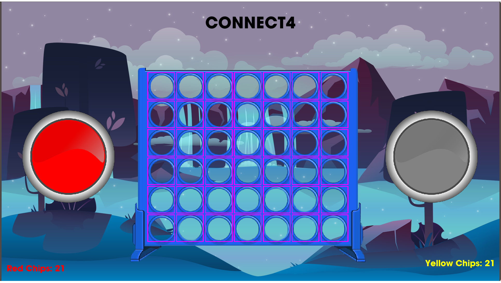

# connect4
Collaborative C++ project using SFML

## Current Game Screenshot

## Prereqs
* https://www.sfml-dev.org/tutorials/2.5/

## Coding Standards
https://google.github.io/styleguide/cppguide.html
